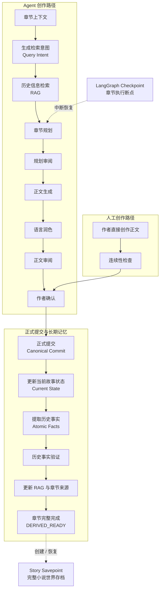

# Writer-Agent

> 面向长篇小说创作的 **Agent Workflow 系统**。  
> 支持多 Agent 协作、Human-in-the-loop、长期记忆 RAG、断点恢复、正式历史管理与 Story Savepoint。

Writer-Agent 不只是“调用大模型写小说”，而是围绕长篇创作中的真实工程问题设计：

- 长流程中断后如何继续；
- Agent 如何读取多章以前的历史；
- 如何区分候选正文与已经成为正式历史的章节；
- 正式提交后派生失败如何恢复；
- 作者如何只使用系统的数据管理能力；
- 如何保存并恢复整个小说世界。

> 📘 本文面向使用者。  
> 🛠️ 需要理解实现、状态机、RAG、持久化和后续开发，请阅读 [开发技术文档](docs/DEVELOPER_GUIDE.md)。  
> 📂 完整运行结果示例见 [smoke_final_demo](examples/smoke_final_demo/)。

---

## 核心工作流



### 这张图表示什么

- **Agent 创作路径**：从检索意图开始，经过 RAG、规划、写作、润色、审阅，再进入正式提交与派生阶段。
- **人工创作路径**：作者直接写正文，系统负责连续性检查、正式提交与长期记忆更新并根据需要提供新章节需要的信息。
- **正式提交（Canonical Commit）**：章节正式成为当前故事历史。
- **长期派生（Derivation）**：Canonical 之后继续生成 Current State、Atomic Facts、Chapter Sources 与 RAG 数据。
- **章节完整完成（DERIVED_READY）**：表示正文与长期数据都已经完整完成。
- **LangGraph Checkpoint**：用于当前章节流程的断点恢复。
- **Story Savepoint**：用于跨章节保存和恢复某个 `DERIVED_READY` 时刻的完整小说世界。

---

## 三种使用方式

| 模式 | 谁规划 | 谁写正文 | 人工介入 | 推荐场景 |
|---|---|---|---|---|
| Autonomous | Agent | Agent | 较少 | 连续生成、自动化测试 |
| Supervised | Agent | Agent | Review 节点 | 默认推荐的 Agent 使用方式 |
| Human / Data Management | 作者 | 作者 | 全程作者控制 | 人工写作 + 系统管理长期历史 |

### 1）Supervised Agent

```dotenv
CHAPTER_MODE=agent
AGENT_EXECUTION=supervised
```

推荐作为默认 Agent 使用方式。

### 2）Autonomous Agent

```dotenv
CHAPTER_MODE=agent
AGENT_EXECUTION=autonomous
```

Review 可以自动处理时持续推进；遇到无法安全解决的问题、错误或卷边界时停止。

### 3）Human / Data Management

```dotenv
CHAPTER_MODE=human
```

作者负责正文，系统负责：

- 可选历史检索；
- 连续性检查；
- 正式提交；
- Current State；
- Atomic Facts / RAG；
- Savepoint。

Human Mode 下，Chapter Intent **可选**：

| 输入 | 行为 |
|---|---|
| 有 Intent | Query Intent → RAG → Writing Context |
| 无 Intent | 直接 Human Writing，不调用 Query Intent / RAG |

无 Intent 时系统会显式记录：

```text
intent_status=SKIPPED
rag_status=SKIPPED
skip_reason=human_direct_write
```

---

## 安装

建议创建独立 Python / Conda 环境。

```bash
python -m pip install -r requirements.txt
```

创建根配置：

### Windows

```powershell
copy .env.example .env
```

### Linux / macOS

```bash
cp .env.example .env
```

项目根目录缺少 `.env` 时 CLI 会拒绝运行。

---

## 模型配置

系统使用四个主模型 Slot：

| Slot | 主要职责 |
|---|---|
| `ARCHITECT` | Proposal、World Setting、Book Plan、Volume Plan |
| `PLAN` | Query Intent、Chapter Plan、Plan Review |
| `WRITE` | Writer、Stylist、正文修改 |
| `SYSTEM` | Review、Current State、Atomic Facts、Derivation |

示例：

```dotenv
SYSTEM_PROVIDER=deepseek
SYSTEM_API_KEY=
SYSTEM_BASE_URL=https://api.deepseek.com
SYSTEM_MODEL=
SYSTEM_MAX_TOKENS=163840

ARCHITECT_PROVIDER=
ARCHITECT_API_KEY=
ARCHITECT_BASE_URL=
ARCHITECT_MODEL=
ARCHITECT_MAX_TOKENS=163840

PLAN_PROVIDER=
PLAN_API_KEY=
PLAN_BASE_URL=
PLAN_MODEL=
PLAN_MAX_TOKENS=163840

QUERY_INTENT_PROVIDER=
QUERY_INTENT_API_KEY=
QUERY_INTENT_BASE_URL=
QUERY_INTENT_MODEL=
QUERY_INTENT_MAX_TOKENS=163840

WRITE_PROVIDER=
WRITE_API_KEY=
WRITE_BASE_URL=
WRITE_MODEL=
WRITE_MAX_TOKENS=163840
```

未单独填写 `QUERY_INTENT_*` 时继承 `PLAN_*`。

---

## Embedding 配置

### 本地模式

```dotenv
EMBEDDING_MODE=local
```

### API 模式

```dotenv
EMBEDDING_MODE=api
EMBEDDING_API_KEY=
EMBEDDING_BASE_URL=
EMBEDDING_MODEL=
EMBEDDING_DIMENSIONS=
```

> **注意：** Embedding 模型与向量维度属于小说长期数据身份。  
> 小说初始化以后不要随意切换 Embedding 模型或维度。

---

## 初始化小说

### 1）生成 Proposal

```bash
python main.py init my_novel "一句话故事前提"
```

生成：

```text
data/novels/my_novel/proposal.md
```

直接编辑该文件。

### 2）确认 Proposal

```bash
python main.py init my_novel --confirm
```

系统生成主要长期资料：

```text
settings/world_setting.md
tracking/book_plan.md
tracking/volume_plan.md
tracking/current_state.md
```

| 文件 | 含义 |
|---|---|
| `world_setting.md` | 世界观和长期硬约束 |
| `book_plan.md` | 全书方向 |
| `volume_plan.md` | 当前卷规划 |
| `current_state.md` | 当前真实故事状态 |

---

## 常用命令

| 命令 | 作用 |
|---|---|
| `status` | 只查看状态 |
| `continue` | 执行下一合法步骤 |
| `write` | 开始 / 恢复章节 |
| `restart` | 当前章重新开始，保留 Intent |
| `clean` | 放弃未完成章节，删除 Intent |
| `repair-derivation` | 修复 Canonical 后的派生失败 |
| `run --to-chapter` | Autonomous 连续运行 |
| `savepoint` | 小说世界存档 / 恢复 |

```bash
python main.py status <novel>
python main.py continue <novel>
python main.py write <novel> --chapter N
python main.py restart <novel> --chapter N
python main.py clean <novel>
python main.py repair-derivation <novel> --chapter N
python main.py run <novel> --to-chapter N
```

最需要记住的是：

```text
status   = 查看
continue = 执行

restart  = 重做当前章，保留 Intent
clean    = 放弃当前未完成章，包括 Intent
```

> `continue` 不是查询命令。  
> 如果最新章节已经 `DERIVED_READY`，执行 `continue` 会直接开始下一章。

---

## Human Mode 写作

### 带 Intent

```bash
python main.py write my_novel \
  --chapter 3 \
  --intent "本章推进主角调查旧地下管线"
```

系统执行：

```text
Intent
→ Query Intent
→ Historical RAG
→ Writing Context
→ Human Writing
```

随后可通过交互菜单提交正文，也可以：

```bash
python main.py write my_novel \
  --chapter 3 \
  --action submit \
  --file ./chapter_3.md
```

### 不使用 RAG

直接：

```bash
python main.py write my_novel --chapter 3
```

或者上一章完成后：

```bash
python main.py continue my_novel
```

系统直接进入 Human Writing。

---

## Agent Mode 写作

```bash
python main.py write my_novel --chapter 3
```

也可以附加作者意图：

```bash
python main.py write my_novel \
  --chapter 3 \
  --intent "本章可以推进双方信任，但不能揭露幕后主使"
```

Agent Mode 即使没有 Human Intent，也会根据：

```text
Volume Plan
Current State
上一章结尾
```

构造 Query Intent 并执行历史检索。

---

## Review 与人工检查点

Supervised 模式会在关键节点等待作者。

| 操作 | 含义 |
|---|---|
| `approve` | 批准当前结果 |
| `agent_edit` | Agent 根据 Review / Feedback 修改 |
| `human_edit` | 作者人工编辑 |
| `regenerate_prose` | 保留 Plan，重新生成正文 |
| `restart` | 当前章从头开始 |
| `confirm_override` | 明确忽略未通过 Review |
| `back` | 退出 Override 确认 |

Review 未通过时：

```text
approve
→ Review Override
→ 再次展示原 Review
→ confirm_override
→ Canonical
```

系统不会把原 Review 结果伪装成 PASS。

---

## Canonical 与 DERIVED_READY

### Canonical

正式章节：

```text
data/novels/<novel>/chapters/chapter_NNNN.md
```

Canonical Commit 之后，普通章节生成流程不能覆盖正式正文。

### Derivation

Canonical 后继续生成长期状态：

```text
Canonical Chapter
      ↓
Current State
      ↓
Atomic Facts
      ↓
Fact Verification
      ↓
Volume Progress
      ↓
Chapter Sources
      ↓
Chroma / RAG
      ↓
DERIVED_READY
```

只有：

```text
DERIVED_READY
```

才意味着这一章**正文和长期数据均完整完成**。

如果 Canonical 已经存在但 Derivation 中断：

```bash
python main.py continue my_novel
```

或：

```bash
python main.py repair-derivation my_novel --chapter N
```

不要因为派生失败重新生成已经 Canonical 的正文。

---

## Workflow Recovery

| 场景 | 操作 |
|---|---|
| 当前章想重新生成，但保留 Intent | `restart` |
| 误进入下一章，希望彻底放弃 | `clean` |
| Canonical 后派生失败 | `continue` / `repair-derivation` |
| 希望恢复整个过去小说世界 | `savepoint load` |

`clean` 会删除当前 Pre-Canonical：

```text
Checkpoint
Intent
Writing Context
Retrieval Trace
Plan
Draft
Review
```

但不会修改：

```text
Canonical Chapter
Current State
Atomic Facts
Chroma
Story Savepoint
Generation History
```

重复执行 `clean` 是安全的。

---

## Story Savepoint

Story Savepoint 与 LangGraph Checkpoint 是两种不同机制：

```text
LangGraph Checkpoint
= 当前章节执行到了哪里

Story Savepoint
= 某个 DERIVED_READY 时刻的完整小说世界
```

### 创建

```bash
python main.py savepoint create my_novel
```

### 查看

```bash
python main.py savepoint list my_novel
```

### 验证

```bash
python main.py savepoint verify my_novel S0040
```

### 加载

```bash
python main.py savepoint load my_novel S0040
```

Load 会要求两次人工确认：

```text
小说名称
LOAD S0040
```

加载旧 Savepoint **不会删除其他 READY Savepoint**，因此可以在多个保存世界之间切换。

### 自动保存

小说级 `.env`：

```dotenv
AUTO_SAVEPOINT_EVERY=50
```

意味着：

```text
Chapter 50
Chapter 100
Chapter 150
...
```

达到 `DERIVED_READY` 后自动创建 Savepoint。

`0` 表示关闭。

---

## 长期记忆 RAG

Writer-Agent 不直接对整章正文做向量检索。

当前检索链路：

```text
Volume Plan
+ Current State
+ 上一章结尾
+ Human Intent（可选）
        ↓
Query Intent
        ↓
Atomic Facts
        ↓
Vector Retrieval
        ↓
source_ranges
        ↓
Canonical Historical Prose
        ↓
Planner / Writing Context
```

| 组件 | 职责 |
|---|---|
| Query Intent | 决定“这一章需要查什么” |
| Atomic Facts | 可检索的历史事实 |
| Chroma | Atomic Fact 向量召回 |
| `source_ranges` | Fact 对应的历史正文地址 |
| Canonical Historical Prose | 最终提供给 Planner / 作者的原始历史依据 |

核心原则：

- Query Intent ≠ Chapter Plan；
- 只检索当前章之前的历史；
- Chroma 嵌入 Atomic Facts，而不是整章正文；
- 命中 Fact 后重新读取对应 Canonical 原文；
- 不静默截断正式上下文。

---

## 卷生命周期

关闭当前卷：

```bash
python main.py close-volume my_novel
```

系统不会因为规划认为“本卷该结束了”就自动关闭。

创建下一卷：

```bash
python main.py new-volume my_novel
```

也可以补充方向：

```bash
python main.py new-volume my_novel \
  --notes "下一卷开始汇合两条支线"
```

新卷规划基于：

```text
World Setting
Book Plan
Current State
上一卷结果
```

继续生成。

---

## 测试与验证

项目当前同时使用：

```text
Automated Regression Tests
+
Real Provider Smoke Test
```

自动测试基线：

```bash
python -m pytest -q
```

当前验收：

```text
327 passed
86 subtests passed
```

Real Smoke 已实际覆盖：

| 场景 | 状态 |
|---|---|
| Agent 完整章节闭环 | PASS |
| Human + Intent + RAG | PASS |
| Human 无 Intent Direct Write | PASS |
| Canonical / Derivation | PASS |
| Atomic Fact Verification | PASS |
| `continue` / `restart` / `clean` | PASS |
| Derivation Recovery | PASS |
| Story Savepoint Create / Load | PASS |
| Savepoint 向前 / 向后恢复 | PASS |
| Savepoint 恢复后的 RAG | PASS |
| Canonical Historical Prose 回读 | PASS |

---

## Example

仓库提供：

**[smoke_final_demo](examples/smoke_final_demo/)**

它来自真实 API Smoke Test，并展示：

| Chapter | 示例 |
|---|---|
| Chapter 2 | Human Intent + RAG |
| Chapter 3 | Human Direct Write |
| Chapter 4 | Agent Workflow |

Example 中包含代表性的：

```text
Canonical Chapters
Chapter Plan
Writing Context
Current State
Chapter Sources
Fact Digest
DERIVED_READY
```

不包含：

```text
API Key
SQLite
LangGraph Checkpoint
Chroma Database
Story Savepoint Binary Data
Candidate / Repair / Attempt Files
```

因此它是**可读架构示例**，不是可直接 Load 的 Savepoint。

---

## 常见问题

| 问题 | 处理 |
|---|---|
| 只想看当前状态 | `status` |
| 最新章完成，开始下一章 | `continue` |
| `continue` 误进入下一章 | `clean` |
| 当前章想重新生成 | `restart` |
| Canonical 已存在但派生失败 | `continue` / `repair-derivation` |
| Human Mode 不需要 RAG | 不提供 Intent |
| Human Mode 希望查历史 | 提供 Intent |
| Savepoint Load 提示有未完成 workflow | 先完成或 `clean` |
| Token Warning | 当前是诊断警告，不会截断或拒绝调用 |

---

## 开发文档

README 只负责：

```text
怎么使用 Writer-Agent
```

如果需要理解：

- LangGraph 状态机；
- Planner / Writer / Stylist / Reviewer 职责；
- Canonical / Derivation 边界；
- Current State 2.0；
- Query Intent；
- Atomic Fact RAG；
- `source_ranges`；
- Checkpoint；
- Generation Events；
- Story Savepoint；
- SQLite / Chroma；
- 测试体系；
- Future Design：Chapter-level Timeline Rewind；

请阅读：

## [Writer-Agent 开发技术文档](docs/DEVELOPER_GUIDE.md)

---

## 项目状态

当前核心 Workflow、RAG、Human-in-the-loop、恢复机制和 Story Savepoint 均已完成自动测试与真实 API Smoke Test。
