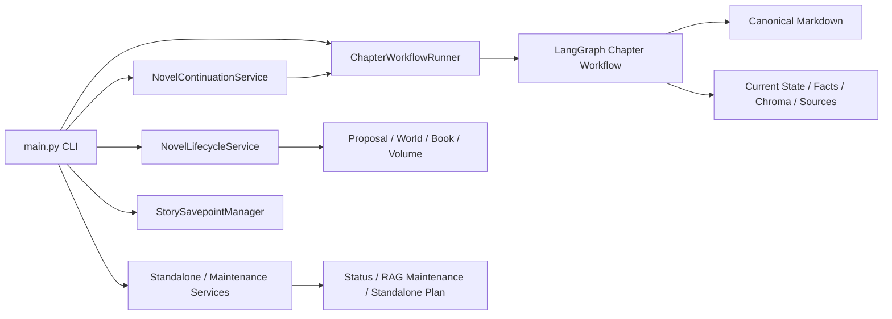
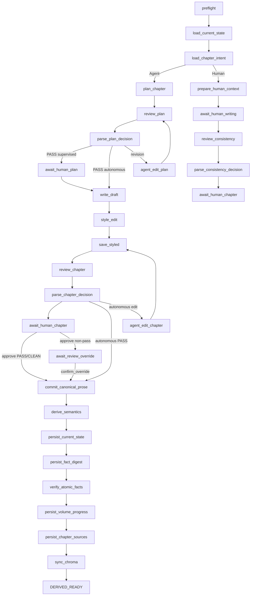
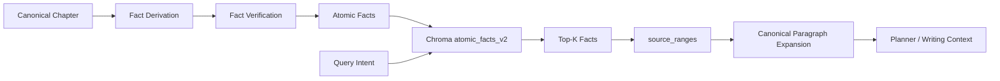
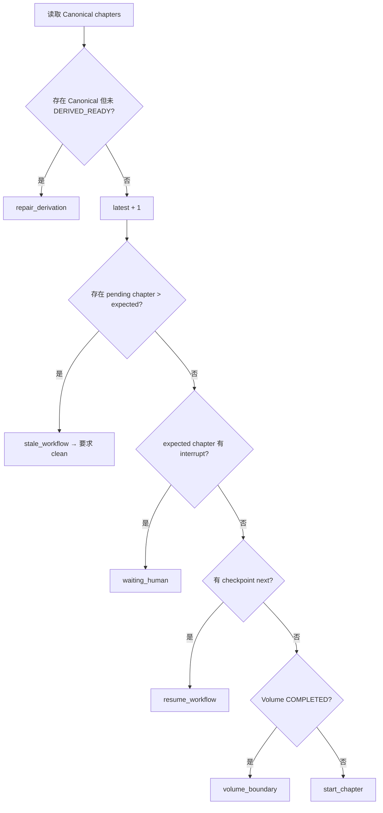

# Writer-Agent 开发技术文档

> 面向 Writer-Agent 的维护者与后续开发者。
>
> 本文描述当前生产架构、关键不变量、具体技术实现、失败恢复语义、测试方法和未来扩展边界。使用方法请先阅读仓库根目录 [README](../README.md)。
>
> 配套可读数据样例见 [smoke_final_demo](../examples/smoke_final_demo/README.md)；该目录用于理解产物，不是可加载 Savepoint。
>
> 文档基线：`f5d1697 完善章节工作流清理与人工直写` + 2026-08-13 Real Smoke 全量通过。
>
> **事实来源优先级：生产代码 > 自动测试 > 本文。** 如果未来实现发生变化而本文未更新，应以代码和测试为准。

---

# 1. 系统目标与核心设计原则

Writer-Agent 的目标不是简单调用一个 LLM 生成章节，而是维护一个可长期运行、可恢复、可审计的长篇小说生产系统。

核心工程问题包括：

1. 长篇故事状态不能只存在于模型上下文；
2. 每章生成过程需要可中断、可恢复；
3. 正式正文与派生数据必须分离；
4. RAG 只能使用已经发生的历史事实；
5. 人工作者必须拥有最终 Canonical 权限；
6. 派生失败不能撤销已经正式提交的正文；
7. 小说级历史版本恢复不能依赖单章 LangGraph checkpoint；
8. 系统需要留下“这一章为什么这样生成”的可审计记录。

由此形成当前几个最重要的不变量：

```text
Canonical Prose
= 当前故事历史的正文权威

Current State
= 从 Canonical 历史派生出的当前故事状态报告

Atomic Facts / Chroma
= 可重建的历史检索层

LangGraph Checkpoint
= 单章执行位置

Story Savepoint
= 整个小说世界的长期快照
```

任何开发都应首先确认是否破坏这些边界。

---

# 2. 顶层架构

系统主要分为四层：



## 2.1 主要职责

| 组件 | 职责 |
|---|---|
| `main.py` | CLI 组合层、交互菜单、命令路由、运行耗时输出 |
| `NovelLifecycleService` | Proposal 初始化、长期规划、卷生命周期 |
| `NovelContinuationService` | 根据 durable state + checkpoint 计算下一合法动作 |
| `ChapterWorkflowRunner` | 启动、检查、恢复、restart、clean、repair 单章工作流 |
| LangGraph Chapter Workflow | 单章 Planning / Writing / Review / Commit / Derivation |
| `CurrentStateStore` | Current State Markdown 与 SQLite 投影一致性 |
| `ChapterRetrievalService` | 执行 Query Intent → Atomic Fact / Author RAG |
| `AtomicFactStore` | Chroma `atomic_facts_v2` 检索索引 |
| `StorySavepointManager` | 小说级不可变快照、校验、事务式恢复 |

LangGraph **只负责单章工作流**。它不拥有小说级 Savepoint、卷生命周期或广义 timeline rollback。

---

# 3. 配置架构

## 3.1 Root `.env`

Root `.env` 负责模型和默认运行参数。项目根目录缺少 `.env` 时 CLI 直接拒绝执行。

当前主模型槽位：

| Slot | 默认职责 |
|---|---|
| `SYSTEM` | Review、State/Derivation 等系统任务 |
| `ARCHITECT` | Proposal、World、Book、Volume |
| `PLAN` | Query Intent、Planning、Plan Review |
| `WRITE` | Writer、Stylist、Writer revise |

`ARCHITECT/PLAN/WRITE` 未显式配置 Provider/API 时，可以继承 `SYSTEM` 连接配置；各 Slot 仍可指定独立 model 和 max tokens。

Query Intent Builder 使用独立的 PLAN 子配置：

```text
QUERY_INTENT_PROVIDER
QUERY_INTENT_API_KEY
QUERY_INTENT_BASE_URL
QUERY_INTENT_MODEL
QUERY_INTENT_MAX_TOKENS
```

空值继承 PLAN。

## 3.2 Novel-level `.env`

初始化新小说时：

```text
data/novels/<novel_id>/.env
```

会固化当前运行策略，只允许以下白名单：

```text
CHAPTER_MODE
AGENT_EXECUTION
AUTO_SAVEPOINT_EVERY
RAG_TOP_K
```

加载优先级：

```text
novel .env
> root .env effective settings
> code defaults
```

这使不同小说可以独立选择 supervised / autonomous / human，而不会修改进程全局环境。

## 3.3 Embedding Identity

Embedding 配置在小说初始化时探测并绑定。

长期身份包括：

```text
embedding_mode
embedding_model
embedding_dimensions
```

这是 RAG 数据的一部分，不应在小说生命周期中随意更换。

---

# 4. 三种运行模式

## 4.1 Agent + Supervised

```dotenv
CHAPTER_MODE=agent
AGENT_EXECUTION=supervised
```

Agent 完成规划和正文，但 Plan Review 和 Prose Review 后进入 Human interrupt。

## 4.2 Agent + Autonomous

```dotenv
CHAPTER_MODE=agent
AGENT_EXECUTION=autonomous
```

PASS 自动推进；NEEDS_REVISION 在有限次数内允许 Agent 自修，无法收敛后仍进入 Human Boundary。

`run --to-chapter` 只允许该模式。

## 4.3 Human / Data Management

```dotenv
CHAPTER_MODE=human
```

不进入 Chapter Planner / Writer / Stylist 主链。

存在 Human Intent：

```text
Intent
→ Query Intent
→ Historical RAG
→ Writing Context
→ Human Writing
→ Consistency Review
→ Human Approval
→ Canonical
→ Derivation
```

不存在 Human Intent：

```text
load current state
→ Intent 为空
→ prepare_human_context 检测空 Intent
→ _prepare_human_direct_write
→ Human Writing
```

此时状态显式记录：

```text
intent_status = SKIPPED
rag_status = SKIPPED
skip_reason = human_direct_write
retrieval_success = False
retrieval_result_count = 0
retrieval_trace_path = ""
```

该分支不会实例化 Query Intent Builder，也不会执行 Retrieval，因此不会产生 Retrieval Trace。

这是数据管理模式与 Agent Mode 的重要区别：

- Agent Mode 没有 Human Intent 时仍会根据正式状态生成 Query Intent；
- Human Mode 没有 Human Intent 时直接跳过 RAG。

---

# 5. ChapterWorkflowState 与 LangGraph

`ChapterWorkflowState` 是单章 checkpointed execution 的跨节点状态。关键字段分组如下。

## 5.1 身份与运行策略

```text
novel_id
branch_id
chapter_index
chapter_mode
agent_execution
auto_savepoint_every
rag_top_k
```

当前 production 只支持：

```text
branch_id = main
```

## 5.2 输入和检索

```text
chapter_intent
intent_status
rag_status
skip_reason
current_state_text
current_state_sha256
query_intent
historical_evidence
retrieved_facts
expanded_sources
retrieval_trace_path
```

## 5.3 Planning / Writing / Review

```text
chapter_plan_text
plan_verdict
plan_review_issues
human_feedback
draft_text
styled_text
candidate_text
verdict
consistency_verdict
review_issues
final_author_approved
review_override_confirmed
```

## 5.4 Derivation / Completion

```text
canonical_source_path
updated_current_state_text
verified_atomic_facts
completion_marker_path
chapter_sources_path
workflow_status
generation_events
```

---

# 6. 当前 LangGraph 拓扑

当前图的主要生产节点：



注意：节点名不是稳定外部 API，但体现当前实现职责。

---

# 7. Planning 与 Query Intent

## 7.1 Query Intent 的职责

Query Intent Builder 是一个单独的小 Agent，负责：

> 把本章真正需要查找的历史人物、事件、物品、关系、伏笔、地点和约束压缩成唯一的 embedding query。

输入：

```text
完整 Volume Plan
+ 上一章结尾完整段落窗口
+ 完整 Current State
+ Human Chapter Intent（可为空）
```

Human Intent 存在时优先级最高。

Query Intent **不是 Chapter Plan**，也不应复述全部上下文。

## 7.2 Query Intent 长度协议

生产代码只有一个严重异常硬阈值：

```text
SEVERE_QUERY_INTENT_CHARS = 10000
```

第一次输出 `< 10000`：直接接受。

第一次 `>= 10000`：携带明确错误反馈自动重做一次，并要求：

```text
目标最好 <= 1000 字
通常不要超过 3000 字
```

第二次仍 `>= 10000`：失败，不静默截断。

## 7.3 Recent Context

上一章结尾通过共享 helper 获取：

```text
约 1500 中文字符
按完整段落从末尾向前累计
允许为了完整段落略微超过目标
不从段落中间硬切
```

Planner、Query Intent Builder、Writer 使用统一 Recent Context 语义。

---

# 8. Atomic Fact RAG

当前历史检索不是把整章正文直接切块后做全文向量召回，而是：



## 8.1 AtomicFactStore

Chroma collection：

```text
atomic_facts_v2
```

Chroma `documents` 保存：

```text
Fact Text
```

不是整章正文。

metadata 主要包括：

```text
novel_id
branch_id
source_type
fact_id
chapter_index
source_ranges
canonical_hash
source_path
digest_path
```

检索 filter：

```text
novel_id == current novel
branch_id == main
chapter_index < current chapter
source_type == atomic_fact
```

从机制上阻止“检索未来章节”。

## 8.2 source_ranges 与原文回读

命中 Fact 后，`ChapterRetrievalService` 只允许解析到唯一 Canonical chapter。

通过 `source_ranges` 定位事实对应的 paragraph range，并默认展开：

```text
事实段落
+ 前 1 段
+ 后 1 段
```

回读文本带稳定段落编号：

```text
[P0040] ...
[P0041] ...
```

因此 Retrieval 的两层语义是：

```text
向量层：找 Fact
证据层：回 Canonical 原文
```

## 8.3 Retrieval Trace

执行 RAG 时生成：

```text
tracking/rag_traces/retrieval_trace_chNNNN_<timestamp>.json
```

包含：

```text
query
top_k
filters
results
timestamp
success / error
```

Human Direct Write 跳过 RAG 时，不生成 Trace。

## 8.4 Author RAG

唯一权威文件：

```text
tracking/author_rag.md
```

旧的 `author_rag_edited.md` 不再具有覆盖权。

Author Knowledge 是补充知识，不允许覆盖：

```text
World Setting
Current State
已建立 Atomic Facts
```

---

# 9. Planner / Writer / Stylist / Reviewer 职责边界

当前职责划分：

| 组件 | 负责 | 明确不负责 |
|---|---|---|
| QueryIntentBuilder | 决定查什么 | 规划本章剧情 |
| ChapterRetrievalService | 执行历史检索 | 决定怎么写 |
| ChapterPlanner | 根据正式规划和历史资料形成 Chapter Plan | 写正文 |
| PlanReviewer | 校验 Plan | 自动绕过 Review |
| Writer | 根据 Approved Plan 写初稿；Review 后按 issues + feedback 修改 | 直接改变长期规划 |
| Stylist | **只对首次 Writer Draft 做语言润色** | 消费 Review issues / human feedback；再次规划 |
| Prose Reviewer | 输出 verdict / issues | 自动 Canonical Commit；生成故事状态 |
| Human | 最终审批与 Override | — |
| Deriver | 从 Canonical 更新派生状态 | 修改正文；把未来计划制造成已发生事实 |

## 9.1 StyleChecker 已退出正式工作流

当前正式流程中没有独立 StyleChecker。

Stylist 的职责收窄为：

```text
Writer 首次 Draft
→ Stylist 语言润色
→ Review
```

Review 之后需要修改：

```text
reviewer_issues + human_feedback
→ Writer.revise_chapter
```

不会再次交给 Stylist 处理 Review feedback。

---

# 10. Review 与 Human Approval

## 10.1 Plan Review

`Plan Review UNKNOWN` fail-closed，Writer 不得执行。

Supervised 模式：

- PASS → Human checkpoint；
- NEEDS_REVISION → Agent Edit / Human Edit / Restart；
- Human Edit 后必须重新 Review。

Autonomous 模式允许有限自动 Plan revision，超出限制后进入 Human。

## 10.2 Prose Review

Prose Review 解析为确定性 decision。

`UNKNOWN`：

```text
commit blocked fail-closed
```

Agent Mode `PASS` 后：

- supervised：仍需作者 Final Approval；
- autonomous：可以自动形成 final_author_approved。

## 10.3 Human Mode Consistency Review

Human Mode 使用 `Consistency Review`，正常通过状态为：

```text
CLEAN
```

之后仍需要作者批准。

## 10.4 Review Override

非 PASS / 非 CLEAN 时：

```text
approve
→ REVIEW_OVERRIDE_REQUESTED
→ 独立 await_review_override
```

只有：

```text
confirm_override
```

才允许 Canonical Commit。

原始 Review verdict 和 warnings 不会被改写成 PASS/CLEAN。

---

# 11. Canonical 边界

正式正文固定路径：

```text
chapters/chapter_NNNN.md
```

`FileStore.commit_canonical_chapter` 使用 create-once 语义。

Canonical 前存在多种 candidate：

```text
draft
styled
human_candidate
edited candidate
review artifacts
```

它们都不能覆盖已存在 Canonical。

Canonical authorization 条件：

```text
final_author_approved == True
AND
(
  normal review passed
  OR review_override_confirmed == True
)
```

Canonical Commit 成功之后：

```text
workflow_status = CANONICAL_COMMITTED
```

此时正文已成为故事事实，即使后续 Derivation 失败也不得回滚正文。

---

# 12. Derivation Pipeline

当前 Canonical 后依次执行：

```text
derive_semantics
→ persist_current_state
→ persist_fact_digest
→ verify_atomic_facts
→ persist_volume_progress
→ persist_chapter_sources
→ sync_chroma
→ DERIVED_READY
```

每一个阶段都有 checkpoint 状态和 generation event。

任何阶段失败：

```text
DERIVATION_ERROR
canonical 保留
failed_derivation_stage 持久化
```

恢复：

```text
continue
```

或：

```bash
python main.py repair-derivation <novel> --chapter N
```

从第一个未完成派生阶段继续。

---

# 13. Current State 2.0

`tracking/current_state.md` 是面向 Human + LLM 的可读 Current State 报告，同时保持结构化 schema 可验证。

其核心内容：

```text
Characters
Relationships
Items
Cultivation
Foreshadowing
Current Chapter metadata
```

## 13.1 Raw Markdown 输入语义

章节开始时：

```text
CurrentStateStore.ensure_raw_initialized()
```

读取完整 Markdown 文本和 SHA256，checkpoint 固定：

```text
current_state_text
current_state_sha256
```

这避免工作流运行过程中 Current State 被外部更改却静默继续。

## 13.2 持久化

新 Current State 在 commit 前会：

1. 非空检查；
2. `CurrentState.from_markdown()` schema 校验；
3. base SHA 校验；
4. 写 `tracking/current_state.md`；
5. 写 derived marker；
6. 维护 SQLite projection。

Structured commit 路径使用 SQLite transaction：

```text
BEGIN IMMEDIATE
→ Markdown
→ SQLite projection
→ marker
→ COMMIT
```

失败时 rollback SQLite，并尽可能恢复 Markdown / marker。

## 13.3 `state.db`

SQLite 是精确查询投影，不是比 Canonical Markdown 更高的故事权威。

数据冲突的逻辑优先级应保持：

```text
Canonical story / plans
> Current State Markdown
> SQLite projection
> Chroma index
> checkpoint / diagnostics
```

---

# 14. Atomic Facts 与 Fact Verification

Canonical 正文产生 Fact Digest / Atomic Facts 后，还会进入独立 verification 阶段。

目标是保证：

```text
Fact Text
source_ranges
chapter_index
canonical source identity
```

能够对应真实 Canonical 内容。

只有验证完成后才进入后续 RAG 同步。

Chroma ID 采用稳定格式：

```text
<novel>_<branch>_FACT-NNNN-XXX
```

同一章节重新索引时采用 replace semantics：先删除该章旧 Facts，再写入本次有效 Facts。

---

# 15. Chapter Sources 与 Generation Events

## 15.1 Generation Events

当前 generation event 类型包括：

```text
INTENT_FINALIZED
QUERY_INTENT_FINALIZED
QUERY_INTENT_RETRIED
RETRIEVAL_COMPLETED
PLAN_CREATED
PLAN_REVIEWED
PLAN_AGENT_EDITED
PLAN_HUMAN_EDITED
PROSE_CREATED
STYLE_COMPLETED
PROSE_REVIEWED
PROSE_REGENERATED
PROSE_AGENT_EDITED
PROSE_HUMAN_EDITED
CONSISTENCY_REVIEWED
REVIEW_OVERRIDE_REQUESTED
REVIEW_OVERRIDE_CONFIRMED
CANONICAL_COMMITTED
CURRENT_STATE_UPDATED
ATOMIC_FACTS_DERIVED
FACT_VERIFICATION_COMPLETED
RAG_UPDATED
DERIVATION_FAILED
DERIVATION_RECOVERED
DERIVED_READY
AUTO_SAVEPOINT_CREATED
```

Event ID 由 durable workflow identity 生成，merge 时幂等；同 ID 但内容不同会报冲突。

它们承担两类职责：

1. 审计“发生过什么”；
2. 提供运行耗时统计来源。

## 15.2 Chapter Sources

每章：

```text
sources/chapter_NNNN/chapter_sources.md
```

最终报告投影 checkpoint 中的：

```text
Human Intent
Query Intent
Intent / RAG status
Retrieval Trace
Retrieved Facts
Expanded Canonical Sources
Review / Approval
Canonical Commit
DERIVED_READY
Review Override
```

Human Direct Write 会显式记录：

```text
Intent Status: SKIPPED
RAG Status: SKIPPED
Skip Reason: human_direct_write
```

这一文件是当前项目最重要的可观察性 / 可追溯资产之一：它允许开发者回答“本章使用了什么历史资料、在哪一步发生了什么、错误可能在哪里”。

---

# 16. LangGraph Checkpoint

每章稳定 thread ID：

```text
chapter:<novel_id>:<chapter_index 四位数>
```

数据库：

```text
data/novels/<novel>/workflow_checkpoints.sqlite
```

Runner 负责：

1. 启动新工作流；
2. 检查 pending interrupt；
3. `Command(resume=...)` 恢复；
4. Pre-Canonical restart / clean；
5. Canonical 后保留 DERIVATION_ERROR；
6. DERIVED_READY 后避免重放；
7. 检测 Canonical create-once。

Checkpoint 的定义必须保持：

> execution state，不是 story history。

因此不能用 LangGraph checkpoint 代替 Story Savepoint。

---

# 17. `continue` 路由

`NovelContinuationService.route()` 的核心顺序：



原则：

```text
Creative completion 由 durable files / DERIVED_READY 判断
LangGraph 只用于恢复未完成 execution
```

这也是 Savepoint Load 后即使不恢复旧 workflow checkpoint，仍能正确继续创作的基础。

---

# 18. `restart` 与 `clean`

## 18.1 restart

```bash
python main.py restart <novel> --chapter N
```

仅允许 Pre-Canonical。

清除候选执行产物，但：

```text
preserve_intent = True
```

之后重新进入本章 workflow。

## 18.2 clean

```bash
python main.py clean <novel>
```

定义：

> 放弃所有位于最新 Canonical 之后的未完成 Pre-Canonical workflow，并恢复到 durable boundary。

来源包括：

1. checkpoint 中非 terminal workflow；
2. 扫描到的 orphan Pre-Canonical artifacts。

当前扫描主要覆盖：

```text
briefs/chapter_intent_ch*.md
tracking/writing_context_ch*.md
tracking/rag_traces/retrieval_trace_ch*.json
outlines/chapter_plan_ch*.md
outlines/scene_plan_ch*.md
chapters/*draft*
chapters/*revision*
chapters/*styled*
chapters/*human_candidate*
chapters/scene_ch*.md
states/review_ch*.md
states/consistency_review_ch*.md
```

逐章调用：

```text
ChapterWorkflowRunner.clean()
→ _discard_candidate(preserve_intent=False)
```

`clean` 与 `restart` 的最关键区别：

```text
restart = intent 保留
clean   = intent 删除
```

底层 `_discard_candidate` 检测 Canonical 存在时 fail-closed。

`clean` 设计为幂等：没有待清理 workflow 时返回空清单，不报错。

---

# 19. Stale Workflow Guard

Real Smoke 暴露过：

```text
latest durable = Chapter 2
pending workflow = Chapter 5
```

`continue` 现在显式检查：

```text
pending chapter > latest + 1
```

若存在则：

```text
stale_workflow
→ 拒绝推进
→ 显示冲突章节
→ 提示 python main.py clean <novel>
```

这是安全 guard，不应回退为“直接采用最大的 pending chapter”。

### 当前已知非阻断显示差异

`NovelStatusService` 的摘要仍主要根据 latest durable + expected chapter 推导，因此极端 stale future workflow 可能不会在 `status` 中显示；真正执行 `continue` 时 guard 会阻断并提示 `clean`。

当前产品决策：不作为阻断项修复。

未来如果统一，应抽共享的 **只读 continuation decision helper**，避免 `status` 和 `continue` 复制两套状态规则。

---

# 20. Story Savepoint 架构

Story Savepoint 已正式实现并通过 Real Smoke。

管理器：

```text
StorySavepointManager
```

目录：

```text
data/novels/<novel>/story_savepoints/SNNNN/
```

当前：

```text
schema_version = 1
branch_id = main
status = READY
```

## 20.1 Creation Boundary

创建前要求：

```text
存在最新 Canonical chapter
最新章 is_derived_ready == True
无 pending chapter workflow
Current State through_chapter == latest canonical
Current State Current Chapter == latest canonical
state.db 存在
```

Savepoint ID：

```text
S<latest chapter 四位数>
```

READY Savepoint 不允许覆盖。

## 20.2 Capture 内容

### Creative Files

递归复制小说目录中的 creative files，但排除：

```text
story_savepoints
staging/temp/cache
state.db
workflow_checkpoints.sqlite
lock/tmp
LOAD_ERROR.json
```

### SQLite

`state.db` 使用 SQLite backup API 创建一致快照，并执行：

```text
PRAGMA integrity_check
```

普通用户 Savepoint 不保存 workflow checkpoint；内部 safety snapshot 可选保存 workflow DB。

### Chroma

当前导出两个 collection：

```text
atomic_facts_v2
author_rag collection
```

只导出：

```text
novel_id == target novel
branch_id == main
```

完整保存：

```text
ids
documents
metadatas
embeddings
collection metadata
```

因此 Load 不需要重新调用 Embedding API 才能恢复历史向量世界。

## 20.3 Manifest 与 Verify

Manifest 记录：

```text
schema_version
savepoint_id
novel_id
branch_id
chapter_index
created_at
status
files + SHA256 + size
SQLite snapshot + hash + integrity
Chroma record_count + snapshot hash + logical hash
```

创建流程：

```text
.staging-Sxxxx-uuid
→ capture
→ verify(require_ready=False)
→ status = READY
→ verify(require_ready=True)
→ atomic rename 到 Sxxxx
```

失败时 staging 删除，不留下半成品 READY 存档。

## 20.4 Load 的事务式安全

Load 首先验证目标 Savepoint，然后拒绝任何 pending workflow。

拿到 novel mutation lock 后再次检查 pending，关闭 race window。

之后自动创建内部 safety snapshot：

```text
story_savepoints/.internal/safety-<uuid>
```

恢复目标时：

1. 删除当前 creative files 中目标不存在的未来文件；
2. 原子复制 Savepoint creative files；
3. 恢复 `state.db`；
4. 恢复目标小说的 Chroma records + embeddings；
5. 清理 `chapter_index > savepoint chapter` 的 workflow checkpoints；
6. 验证 live world。

Live verify 检查：

```text
latest canonical chapter
Current State chapter
DERIVED_READY marker
state.db integrity + hash
所有 creative file hash
live Chroma logical hash
```

如果目标 Load 失败：

```text
自动用 internal safety snapshot 恢复加载前状态
```

如果目标 Load 和 safety restore 都失败：

```text
写 LOAD_ERROR.json
→ 阻断后续小说写操作
→ 要求人工恢复
```

这是 Savepoint 最重要的 fail-safe 设计。

## 20.5 Savepoint 与 Checkpoint

再次强调：

```text
Checkpoint
= 单章执行位置

Savepoint
= 完整创作世界
```

Load 普通 Savepoint 时不会把旧的进行中 workflow 当作创作权威重新加载；它恢复 durable world，并清理未来 checkpoint。

---

# 21. Auto Savepoint

配置：

```dotenv
AUTO_SAVEPOINT_EVERY=N
```

只有章节真正完成 `DERIVED_READY` 后才允许触发。

成功事件：

```text
AUTO_SAVEPOINT_CREATED
```

`0` 表示关闭。

---

# 22. Volume Lifecycle

卷状态位于小说级生命周期，而非 Chapter Graph。

核心语义：

```text
DRAFT
→ 创作使用
→ COMPLETED
```

当前产品已移除面向用户的 `approve-volume` 命令；初始化或 `new-volume` 产生 DRAFT Volume Plan，作者直接审阅 / 编辑原文件，真正进入章节生产时作为当前卷规划使用。

`Volume Progress` 只提供建议：

```text
CONTINUE
READY_TO_CLOSE
UNKNOWN
```

不会自动改变卷状态。

`close-volume` 的硬条件：

```text
最新 Canonical chapter 必须 DERIVED_READY
```

`new-volume` 主要输入：

```text
World Setting
Book Plan
Current State
上一卷卷级结果 / 总结
Human notes（可选）
```

Current State 用于告诉 ARCHITECT：故事实际上从哪里继续。

---

# 23. Token Guard 的真实语义

这一点必须与旧 README 区分。

当前 `token_guard.py`：

```text
estimate_tokens
→ 计算 CJK + ASCII 近似 Token
→ * 1.15 保守系数
```

当：

```text
Estimated Input Tokens > slot.max_tokens
```

系统只打印：

```text
[Token Warning]
```

并明确：

```text
不会截断
不会压缩
不会阻断正式上下文
继续完整发送
由远端 API 判断是否可执行
```

因此 Token Guard 当前是 **diagnostic warning**，不是 local fail-closed gate。

开发新调用时不要误写测试为“超限必须抛异常”。测试应捕获 stdout 并断言诊断内容存在。

---

# 24. Runtime Observability

CLI 包含 stage timing / generation event duration 汇总。

当前主要可见阶段：

```text
Query Intent
Retrieval
Planning
Plan Review
Agent Plan Edit
Writing
Agent Prose Edit
Styling
Prose Review
Canonical Commit
Current State
Atomic Fact Derivation
Fact Verification
RAG / Embedding
```

`Total` 不包含人工等待时间。

Real Smoke 中这套数据已经用于发现 Current State 等长耗时阶段，因此它既是 UX 输出，也是性能诊断工具。

---

# 25. Failure Semantics

| 失败位置 | 正确语义 |
|---|---|
| Preflight | 终止当前执行，不产生生产副作用 |
| Query Intent / Retrieval | error，禁止下游 Planning / Human RAG context |
| Plan Review UNKNOWN | fail-closed，Writer 不运行 |
| Prose Review UNKNOWN | fail-closed，Canonical 不提交 |
| Human Final Approval 前 | 仍是 Pre-Canonical，可 edit / restart / clean |
| Canonical Commit 失败 | 不进入 Derivation |
| Canonical 后 Derivation 失败 | `DERIVATION_ERROR`，Canonical 保留 |
| Current State 持久化失败 | 回滚相关 Markdown / SQLite / marker |
| Atomic Fact / RAG 更新失败 | 保留 Canonical，进入可恢复派生错误 |
| Savepoint create verify 失败 | 不产生 READY Savepoint |
| Savepoint load 失败 | 自动恢复 internal safety snapshot |
| Load + safety restore 都失败 | `LOAD_ERROR.json` + 阻断写操作 |
| close-volume 时最新章未 DERIVED_READY | 拒绝关闭 |

核心原则：

> **失败不能把“已经发生的正式故事事实”悄悄改回去。**

---

# 26. 当前数据权威与文件职责

| 数据 | 典型路径 | 类型 |
|---|---|---|
| Proposal | `proposal.md` | Human / Canonical planning source |
| World Setting | `settings/world_setting.md` | Canonical planning source |
| Book Plan | `tracking/book_plan.md` | Canonical planning source |
| Volume Plan | `tracking/volume_plan.md` | Canonical lifecycle source |
| Chapter Intent | `briefs/chapter_intent_chNNNN.md` | Human intent，可选 |
| Chapter Plan | `outlines/chapter_plan_chNNNN.md` | Approved execution plan |
| Candidate Prose | `chapters/*draft* / *styled* / *human_candidate*` | Pre-Canonical |
| Canonical Prose | `chapters/chapter_NNNN.md` | 正文历史权威 |
| Current State | `tracking/current_state.md` | Generated readable state authority |
| SQLite Projection | `state.db` | 精确查询投影 |
| Fact Digest | `states/fact_digest_chNNNN_*.md` | Derived history |
| Atomic Facts | Chroma `atomic_facts_v2` | Derived retrieval index |
| Author RAG | `tracking/author_rag.md` | Supplemental knowledge authority |
| RAG Trace | `tracking/rag_traces/*.json` | Diagnostics / provenance |
| Chapter Sources | `sources/chapter_NNNN/chapter_sources.md` | Audit projection |
| Chapter Checkpoint | `workflow_checkpoints.sqlite` | Execution recovery |
| Savepoints | `story_savepoints/SNNNN/` | Whole-world durable snapshots |

---

# 27. 自动测试策略

当前原则：

> 测试外部语义和安全 invariant，不把内部 helper/node 名称当稳定契约。

重点覆盖：

```text
Human interrupt / resume
Plan Review / Prose Review fail-closed
PASS 不越过 Human approval（supervised）
Canonical create-once
Canonical 后 derivation
Derivation failure 保留 Canonical
repair → DERIVED_READY
Current State 持久化
Atomic Fact RAG
Query Intent
source_ranges
Review Override
continue / restart / clean
Story Savepoint create / verify / load
per-novel runtime policy
```

测试环境通过 fixture / Fake client 阻止 paid API call。

当前 Full Suite 验收：

```text
327 passed, 86 subtests passed
```

并通过：

```bash
git diff --check
```

---

# 28. Real Smoke 基线

## 28.1 `smoke_final`

2026-08-13 已完成：

```text
Chapter 1
Chapter 2
Chapter 3
```

Chapter 3 完整执行：

```text
Canonical Commit
→ Current State
→ Atomic Facts
→ Fact Verification
→ RAG
→ DERIVED_READY
```

## 28.2 Human Direct Write Smoke

```text
Chapter 2 DERIVED_READY
→ continue Chapter 3
→ 无 Intent
→ 无 Query Intent / Retrieval
→ Human Writing WAITING_HUMAN
→ clean
→ 回 Chapter 2
```

通过。

## 28.3 Human + Intent Smoke

```text
write Chapter 3 --intent ...
→ Query Intent
→ Retrieval
→ Human Writing
→ clean
```

通过。

## 28.4 Savepoint Smoke

已创建：

```text
S0002 = Chapter 2
S0003 = Chapter 3
```

验证：

```text
Chapter 3 world
→ load S0002
→ status = Chapter 2 DERIVED_READY
→ load S0003
→ status = Chapter 3 DERIVED_READY
```

随后从恢复后的 S0003 世界创建 Chapter 4 Intent，RAG 正常召回 Chapter 3 的：

```text
B3-17
手写维修便签
停运记录
Atomic Facts
对应 Canonical paragraphs
```

说明 Savepoint 恢复的不只是 status 文件，而是完整可继续使用的 Current State + Atomic Facts + Chroma + Canonical source world。

再 `clean Chapter 4` 后正确回到 Chapter 3 durable boundary。

结论：Story Savepoint 主功能闭环 PASS。

---

# 29. 当前已知低优先级技术债

## 29.1 `status` 与 stale workflow 展示

前文已述，属于非阻断 UI 一致性问题。

## 29.2 orphan artifact inventory 可能漂移

`clean` 的“扫描 orphan artifact 清单”和 `_discard_candidate()` 的“实际删除清单”目前不是一个共享常量。

例如底层删除还覆盖：

```text
states/derivation_ch*.md
states/fact_digest_ch*.md
```

但上层 orphan scanner 不一定单独依赖这些文件发现 chapter。

正常生产流不应产生“只剩该类派生产物的 Pre-Canonical orphan”，因此当前不阻断；未来如果扩 `clean`，建议抽统一 artifact inventory。

## 29.3 legacy chapter_sources 默认状态

旧 checkpoint 缺少：

```text
intent_status
rag_status
```

最终来源报告兼容默认值偏向：

```text
AVAILABLE / COMPLETED
```

更严格的审计语义可以未来改成：

```text
UNKNOWN / LEGACY
```

## 29.4 ResourceWarning

历史 Full Suite 存在过 SQLite connection 生命周期相关 `ResourceWarning: unclosed database`。当前不影响功能与测试结果，应作为独立数据库生命周期清理任务处理，不应和 workflow feature 混改。

---

# 30. 已退出 / 不应重新引入的旧设计

后续开发需要避免“修着修着又把旧架构加回来”。

当前明确：

```text
StyleChecker
→ 已退出正式工作流

Stylist human_feedback / reviewer issue revision
→ 不属于 Stylist
→ 由 Writer.revise_chapter 消费

author_rag_edited.md
→ 不具备权威覆盖能力

approve-volume CLI
→ 当前用户流程不需要

Canonical 后 restart
→ 禁止

静默截断正式上下文
→ 禁止
```

---

# 31. Future Design：Chapter-level Timeline Rewind

当前 **未实现**。

如果未来需要“从历史 Chapter N 开始重写未来”，已定案采用：

```text
Chapter-level Timeline Rewind
```

而不是直接修改旧 Canonical 后保留下游章节。

## 31.1 核心语义

当前：

```text
C1 → C2 → ... → C72 → C73 → ... → C100
```

执行：

```text
rewind from Chapter 73
```

Active Timeline 变为：

```text
C1 → ... → C72
```

之后重新创作：

```text
C73' → C74' → ...
```

旧 C73-C100 不再属于 active timeline。

## 31.2 为什么必须 downstream invalidation

Chapter 74 是基于：

```text
Old Chapter 73
Old Current State 73
Old Facts <= 73
```

产生的。

修改 Chapter 73 后，旧 Chapter 74 的生成依据已经失效，因此不能假设仍然一致。

## 31.3 Rewind 前必须 Savepoint

未来 Rewind 必须：

```text
create Savepoint
→ verify Savepoint
→ 成功
→ 才允许 destructive rewind
```

禁止先删除未来再保存。

## 31.4 Current State Snapshot

未来建议新增逐章 durable snapshot：

```text
states/current_state_ch0001.md
states/current_state_ch0002.md
...
```

Rewind Chapter 73 时直接恢复：

```text
current_state_ch0072.md
```

避免从 Chapter 1 replay 全历史。

## 31.5 需要清理的 >= N 数据

至少包括：

```text
Canonical Chapters
Chapter Plans
Candidate Prose
chapter_sources
Fact Digests
Current State snapshots
Atomic Facts / Chroma
generation events
LangGraph checkpoints
DERIVED_READY markers
retrieval traces
chapter-level runtime state
```

实现前必须建立完整 rewind inventory。

## 31.6 明确不做

当前 Future Design 明确不优先实现：

```text
直接改旧 Canonical 后沿用原后续章节
额外 archive/rewinds 重复备份
Git-like 多 Branch
自动小说 rebase
branch merge
```

推荐产品模型：

```text
唯一 Active Timeline
+ Story Savepoint 历史版本
+ Chapter Rewind
```

---

# 32. Future Rewind 的前置条件

在真正实现前至少保持：

1. 三种模式长期 Real Smoke 稳定；
2. Canonical / Derivation / recovery 稳定；
3. Savepoint create / verify / load 长期验证；
4. 每章 Current State Snapshot 方案确定；
5. 所有 chapter-derived artifact 能映射 `chapter_index`；
6. Chroma 可可靠按 chapter 清理 / 重建；
7. 能枚举所有 `>= N` active timeline 状态；
8. destructive operation 有事务式失败保护。

目前项目应继续保持：

> 不为了未来 Rewind 提前扩张现有稳定架构。

---

# 33. 后续开发工作方法

当 Real Smoke 再暴露问题时，建议按以下顺序处理：

```text
1. 先确认是 Canonical / Derived / Checkpoint / Savepoint 哪一层的问题
2. 复现并保存真实输入输出
3. 补最小 regression test
4. 修生产代码
5. 跑定向测试
6. 跑 full suite
7. git diff --check
8. 用独立 smoke novel 做真实 API 验收
9. 验证 durable state 没有被旁路修改
10. 独立 commit
```

避免：

```text
看到 parser 错误就只修 parser
为了一个 smoke bug 顺手扩新架构
把 checkpoint 当成故事权威
在 Derivation 失败时撤销 Canonical
用静默截断“解决”上下文问题
```

---

# 34. 维护者快速诊断表

| 现象 | 第一检查点 |
|---|---|
| `continue` 跳错章节 | `NovelContinuationService.route()` + latest canonical + pending threads |
| `status` 与执行不一致 | durable state 与 `NovelStatusService` projection |
| Human Mode 意外调用 RAG | `prepare_human_context()` 空 Intent 分支 |
| RAG 找不到刚完成章节 | Atomic Fact derivation → verification → Chroma sync |
| Fact 命中但没有正文 | `source_ranges` + canonical source path resolution |
| Canonical 后继续生成正文 | preflight / create-once invariant |
| Derivation 重跑了不该重跑阶段 | checkpointed derived stage / recovery marker |
| Current State 内容异常 | canonical chapter + base SHA + CurrentState parser |
| Savepoint Load 后 RAG 不一致 | Chroma logical hash / embeddings snapshot |
| Savepoint 创建被拒绝 | pending workflow / latest DERIVED_READY / Current State chapter |
| `clean` 后仍有临时文件 | orphan scanner 与 discard inventory |
| Token 超限测试失败 | Token Guard 当前是 warning，不抛异常 |

---

# 35. 当前项目阶段结论

截至 2026-08-13：

```text
核心章节工作流           PASS
Human / Agent 双模式     PASS
Supervised / Autonomous  PASS
Query Intent / RAG       PASS
Canonical / Derivation   PASS
Derivation Recovery      PASS
Current State            PASS
Atomic Facts             PASS
Review Override          PASS
restart / continue       PASS
clean                    PASS
Story Savepoint          PASS
Savepoint 双向恢复       PASS
恢复后 RAG               PASS
Full Suite               PASS
Real Smoke               PASS
```

当前推荐开发策略：

> **停止主动扩架构。只有真实长期运行再次暴露的问题才进入下一轮整改。**

下一阶段若只是维护项目，应优先保证文档、测试基线和实际使用体验与现有稳定实现保持同步。
